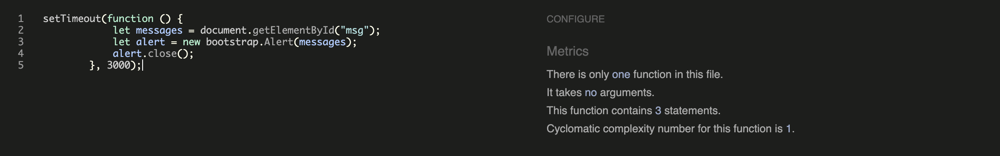

# Vegan Delights

Vegan Delights is a revolutionary meal planning app designed to make vegan cooking hassle-free and enjoyable. This app caters to users who have a passion for delicious plant-based cuisine and love experimenting with new recipes, all while desiring a convenient solution for their daily meal preparations.

The site acts as a repository for recipes whereby users can store their own recipes and also browse other users' recipes and bookmark them for a later date. Users can get organised for the week ahead by adding recipes to their meal planner for each day of the week. 

- The live link can be found here - [Vegan Delights](https://vegan-delights-d7e8edb51d3f.herokuapp.com/)
- The GitHub link can be found here - [Vegan Delights](https://github.com/mehatabpathan/vegan_delights.git)

## Table of Contents

- [Vegan Delights](#vegan-delights)
  * [User Experience (UX)](#user-experience-ux)
    + [User Stories](#user-stories)
    + [Design](#design)
      - [Colour Scheme](#colour-scheme)
      - [Imagery](#imagery)
      - [Fonts](#fonts)
      - [Wireframes](#wireframes)
  * [Agile Methodology](#agile-methodology)
  * [Data Model](#data-model)
  * [Testing](#testing)
    + [HTML Validation](#html-validation)
    + [CSS Validation](#css-validation)
    + [JavaScript Validation](#javascript-validation)
    + [Python Linter Validation](#python-linter-validation)
    + [Lighthouse](#lighthouse)
  * [Security Features and Defensive Design](#security-features-and-defensive-design)
    + [User Authentication](#user-authentication)
    + [Form Validation](#form-validation)
    + [Database Security](#database-security)
    + [Custom error pages](#custom-error-pages)
  * [Features](#features)
    + [Header](#header)
    + [Footer](#footer)
    + [Home Page](#home-page)
    + [User Account Pages](#user-account-pages)
    + [Browse Recipes](#browse-recipes)
    + [Recipe Detail Page](#recipe-detail-page)
    + [Add Recipe Form](#add-recipe-form)
    + [Update Recipe Form](#update-recipe-form)
    + [Delete Recipe](#delete-recipe)
    + [My Meal Plan](#my-meal-plan)
    + [My Recipes Page](#my-recipes-page)
    + [My Bookmarks Page](#my-bookmarks-page)
    + [My Likes Page](#my-likes-page)
    + [Error Pages](#error-pages)
    + [Future Features](#future-features)
  * [Deployment - Heroku](#deployment---heroku)
  * [Forking this repository](#forking-this-repository)
  * [Cloning this repository](#cloning-this-repository)
  * [Languages](#languages)
  * [Frameworks - Libraries - Programs Used](#frameworks---libraries---programs-used)
  * [Credits](#credits)
  * [Acknowledgments](#acknowledgments)

<small><i><a href='http://ecotrust-canada.github.io/markdown-toc/'>Table of contents generated with markdown-toc</a></i></small>
## User Experience (UX)

A Site-Visitor to Vegan Delights would be someone who takes pleasure in savoring delicious meals and exploring new recipes. They are eager to expand and enrich their collection of recipes or simply share them with others.

### User Stories

#### EPIC | User Profile
- As a Site User, I can register myself to this website, so that I can create/update/delete my own recipes and comments.
- As a Site User, I can see my current login status, so that I know if I am logged in or logged out.
- As a Site User, I can log in and out of my account, so that post, comment and like recipes.

#### EPIC | User Navigation
- As a Site User, I can navigate myself throughout the website in an intuitive way, so that I can go back and forth between pages without an issue.
- As a Site User, I can open a recipe with a click, so that I can see the full details, ingredients required, comments and like the recipe.
- As a Site User, I can scroll through a paginated list of recipes, so that I can get a quick overview of many recipes.

#### EPIC | Recipe Management
- As a Site User, I can upload my own recipes through an easy form, so that I can share them with other users.
- As a Site User, I can view my own recipes, so that I can review and manage the recipes I have created.
- As a Site User, I can view all recipes I liked on one page, so that I can sort out my favorite recipes from the big list of all recipes.
- As a Site User, I can edit and delete my own recipes, so that I can keep my recipes up to date or remove them.

#### EPIC | Recipe Interaction
- As a Site User, I can comment on recipes, so that I can give my own feedback or start a conversation.
- As a Site User, I can edit and delete my comments, so that adjust my comments if I made a mistake.
- As a Site User, I can "Like" a recipe, so that I can sort out recipes I like from others.

#### EPIC | Mealplan Management
- As a Site User, I can add/delete recipes to my meal planner for a particular day of the week so that I can create a meal plan for the week ahead.
- As a Site User, I can view my meal plan for the week when I log into my account so that I can plan for the week ahead.

#### EPIC | Site Administration
- As a Site Administrator, I can create, read, update and delete recipes, comments and meal plan items so that I can manage the app content.

### Design

The site has a very simple and clean design which was purposely chosen in order to keep in theme with the site's goal. i.e. invoking a sense of calm in the user and reducing stress when it comes to everyday cooking. 

#### Colour Scheme
Colour palette from Coolors

Throughout the development process, the color scheme underwent several revisions. Ultimately, I opted to adopt a neutral color palette to ensure that the website's purpose remained front and center, without unnecessary distractions. Given that the primary focus of the website is to experiment with and exchange recipes, a white background complemented by subtle light-colored accents felt most appropriate.

For these accents, I selected a golden border, imparting an element of elegance and significance to the showcased recipes. This deliberate choice of colors and highlights aligns with the site's core objectives, contributing to a harmonious and engaging user experience.

#### Imagery
There is only one static image on the site depicting a family dinner on the home page. The rest of the imagery will be uploaded by users for their individual recipes. 

#### Fonts
The Montserrat font is the main font used for the body of the website with the Playfair Display font used for the main headings on the home page. These fonts were imported via Google Fonts. Sans Serif is the backup font, in case for any reason the main font isn't being imported into the site correctly.

#### Wireframes

 
Landing Page

Browse Recipes

Add Recipe

My Recipes

My Bookmarks

## Agile Methodology

Github projects was used to manage the development process using an agile approach. Please see link to project board [here](https://github.com/users/mehatabpathan/projects/4)

The 6 Epics listed above were documented within the Github project as Milestones. A Github Issue was created for each User Story which was then allocated to a milestone(Epic). Each User Story has defined acceptance criteria to make it clear when the User Story has been completed. The acceptance criteria are further broken down into tasks to facilitate the User Story's execution.

## Data Model
I used principles of Object-Oriented Programming throughout this project and Django’s Class-Based Generic Views.  

Django AllAuth was used for the user authentication system.

In order for the users to create recipes a custom recipe model was required. The recipe author is a foreign key to the User model given a recipe can only have one author.

The Comment model allows users to comment on individual recipes and the Recipe is a foreign key in the comment model given a comment can only be linked to one recipe. 

The meal plan item model allows users to add recipes to a meal plan for a particular day. A meal plan item can only have one user and one recipe and is therefore linked to the User and Recipe models through foreign keys.

The diagram below details the database schema.

## Testing

### HTML Validation

All HTML pages were run through the [W3C HTML Validator](https://validator.w3.org/).

Home Page

Explore Recipes

Add Recipe

My Meal Plan

My Recipes

My Likes

My Booksmarks

Logout

Sign Up

Login

Recipe Details (ginger loaf cake)

Recipe Update

Recipe Delete

Comment Update

Comment Delete

### CSS Validation

No errors were found when passing my CSS file through the official [W3C CSS Validator](https://jigsaw.w3.org/css-validator/).

Result

### JavaScript Validation

No errors were found when passing the javascript snippet through [Jshint](https://jshint.com/).

Result

### Python Linter Validation

All Python files I worked with were run through the [CI Python Linter](https://pep8ci.herokuapp.com/).

admin.py

froms.py

models.py

vegan/urls.py

views.py

settings.py

The lines exceeding the maximal length have been solved by adding the # noqa tag.

vegan_deligts/urls.py

### Lighthouse

[Lighthouse](https://developer.chrome.com/docs/lighthouse/overview/) was run on all pages to check Performance, Accessibility, Best Practices, and SEO scores.

Home Page

Explore Recipes

The drop in the performance is explained by the images and styles loading from an external source, [Cloudinary](https://cloudinary.com/).

Add Recipe

My meal Plan

My Recipes

My Likes

My Bookmarks

Logout

Sign Up

Login

Recipe Details (Ginger Loaf Cake)

Recipe Update 

The drop of the [accessibility](<https://cdn.discordapp.com/attachments/1049024982694498367/1136306366114439329/image.png>) is explained by missing titles. The [titles](https://cdn.discordapp.com/attachments/1049024982694498367/1136306366361911477/image.png) are not actually missing. The problem is caused by the use of the Summernote extension.

Recipe Delete

Comment Update

Comment Delete

## Browser Testing
- The website was tested on Google Chrome, Firefox, and Opera browsers with no issues noted.
    
## Device Testing
- The website was viewed on a variety of devices such as Desktop, Laptop, Huawei P20 lite, and Samsung Galaxy S22 to ensure responsiveness on various screen sizes in both portrait and landscape mode. The website performed as intended. The responsive design was also checked using Chrome developer tools across multiple devices with structural integrity holding for the various sizes.

## Manual Testing

### Site Navigation
| Element               | Action     | Expected Result                                                    | Pass/Fail |
|-----------------------|------------|--------------------------------------------------------------------|-----------|
| **NavBar**            |            |                                                                    |           |
| Site Name (logo area) | Click      | Redirect to home                                                   | Pass      |
| Home Link             | Click      | Redirect to home                                                   | Pass      |
| Explore Recipes Link  | Click      | Open Explore Recipes Page                                          | Pass      |
| Add Recipe Link       | Click      | Open Add Recipe Form                                               | Pass      |
| Add Recipe Link       | Display    | Only visible if user in session                                    | Pass      |
| My Meal Plan Link     | Click      | Open My Meal Plan page                                             | Pass      |
| My Meal Plan Link     | Display    | Only visible if user in session                                    | Pass      |
| My Account Dropdown   | Click      | Open My Account dropdown                                           | Pass      |
| My Account Dropdown   | Display    | Text changes to username with profile icon when user is in session | Pass      |
| Sign Up Link          | Click      | Open Sign up page                                                  | Pass      |
| Sign Up Link          | Display    | Not visible if user in session                                     | Pass      |
| Log In Link           | Click      | Open Login page                                                    | Pass      |
| Log In Link           | Display    | Not visible if user in session                                     | Pass      |
| My Recipes Link       | Click      | Open My Recipes page                                               | Pass      |
| My Recipes Link       | Display    | Only visible if user in session                                    | Pass      |
| My Likes Link         | Click      | Open My Likes page                                                 | Pass      |
| My Likes Link         | Display    | Only visible if user in session                                    | Pass      |
| My Bookmarks Link     | Click      | Open My Bookmarks page                                             | Pass      |
| My Bookmarks Link     | Display    | Only visible if user in session                                    | Pass      |
| Logout Link           | Click      | Open logout confirm page                                           | Pass      |
| Logout Link           | Display    | Only visible if user in session                                    | Pass      |
| All Nav Links         | Hover      | lighten text                                                       | Pass      |
|                       |            |                                                                    |           |
| **Mobile View**       |            |                                                                    |           |
| Hamburger Menu        | Responsive | Display when screen size reduces to medium size                    | Pass      |
| My Account Dropdown   | Responsive | Contents move into hamburger menu when screen size reduces to medium           | Pass      |
| Site Name (logo area) | Click      | Redirect to home                                                   | Pass      |
| Home Link             | Click      | Redirect to home                                                   | Pass      |
| Browse Recipes Link   | Click      | Open Browse Recipes Page                                           | Pass      |
| Sign Up Link          | Click      | Open Sign up page                                                  | Pass      |
| Sign Up Link          | Display    | Not visible if user in session                                     | Pass      |
| Log In Link           | Click      | Open Login page                                                    | Pass      |
| Log In Link           | Display    | Not visible if user in session                                     | Pass      |
| Add Recipe Link       | Click      | Open Add Recipe Form                                               | Pass      |
| Add Recipe Link       | Display    | Only visible if user in session                                    | Pass      |
| My Meal Plan Link     | Click      | Open My Meal Plan page                                             | Pass      |
| My Recipes Link       | Click      | Open My Recipes page                                               | Pass      |
| My Recipes Link       | Display    | Only visible if user in session                                    | Pass      |
| My Likes Link         | Click      | Open My Likes page                                                 | Pass      |
| My Likes Link         | Display    | Only visible if user in session                                    | Pass      |
| My Bookmarks Link     | Click      | Open My Bookmarks page                                             | Pass      |
| My Bookmarks Link     | Display    | Only visible if user in session                                    | Pass      |
| Logout Link           | Click      | Open logout confirm page                                           | Pass      |
| Logout Link           | Display    | Only visible if user in session                                    | Pass      |
|                       |            |                                                                    |           |
| **Footer**            |            |                                                                    |           |
| All links             | Click      | Open in new tab and to correct location                            | Pass      |

### Home Page
| Element               | Action  | Expected Result                 | Pass/Fail |
|-----------------------|---------|---------------------------------|-----------|
| Hero 'Sign Up' Button | Click   | Open Sign up page               | Pass      |
| Hero 'Sign Up' Button | Display | Not visible if user in session  | Pass      |
| Hero 'Create" Button  | Click   | Open Add Recipe page            | Pass      |
| Hero 'Create" Button  | Display | Only visible if user in session | Pass      |

### Explore Recipes Page
| Element     | Action                  | Expected Result                                                                         | Pass/Fail |
|-------------|-------------------------|-----------------------------------------------------------------------------------------|-----------|
| Recipe Card | Display correct content | Display correct image, recipe title and cooktime                                        | Pass      |
| Recipe Card | Click                   | Clicking anywhere inside the recipe card takes you to the correct recipe's detail page. | Pass      |
| Recipe Card | Pagination              | Site will paginate 8 recipe cards to a page                                             | Pass      |
| Recipe Card | Order                   | Recipes are sorted by newest to oldest                                                  | Pass      |
| Recipe Card | Hover                   | Add gold border                                                                         | Pass      |

### Recipe Detail Page
| Element                        | Action              | Expected Result                                                                                                         | Pass/Fail |
|--------------------------------|---------------------|-------------------------------------------------------------------------------------------------------------------------|-----------|
| Recipe Content                 | Display             | Display correct recipe image, title, author, prep time, cook time, description, ingredients and method                  | Pass      |
| Add to Meal Plan button        | Click               | Meal Plan modal pops up                                                                                                 | Pass      |
| Add to Meal Plan button        | Display             | Button only visible if user in session                                                                                  | Pass      |
| Bookmark button (Outline)      | Click               | Clicking the outlined bookmark changes it to a solid bookmark                                                           | Pass      |
| Bookmark button (Outline)      | Click               | Recipe is added to the user's bookmarks page                                                                            | Pass      |
| Bookmark button (Outline)      | Click               | Success message appears informing the user that the recipe has been added to their bookmarks                            | Pass      |
| Bookmark button (Outline)      | Click               | Success message fades after 3 seconds                                                                                   | Pass      |
| Bookmark button (Solid)        | Click               | Clicking the solid bookmark changes it back to an outlined bookmark                                                     | Pass      |
| Bookmark button (Solid)        | Click               | Recipe is removed from the user's bookmarks page                                                                        | Pass      |
| Bookmark button (Solid)        | Click               | Success message appears informing the user that the recipe has been removed from bookmarks                              | Pass      |
| Bookmark button (Solid)        | Click               | Success message fades after 3 seconds                                                                                   | Pass      |
| Bookmark button                | Display             | Button only visible if user in session                                                                                  | Pass      |
| Update recipe button           | Click               | Opens Update Recipe Form                                                                                                | Pass      |
| Update recipe button           | Display             | Button only visible if user is the author                                                                               | Pass      |
| Delete recipe button           | Click               | Opens Delete Recipe confirmation page                                                                                   | Pass      |
| Delete recipe button           | Display             | Button only visible if user is the author                                                                               | Pass      |
| User Comments                  | Display             | Displays correct name date time and comment body                                                                        | Pass      |
| User Comments                  | Display             | Comments are ordered oldest to newest                                                                                   | Pass      |
| Update comment button          | Display             | Button only visible if user is the comment author                                                                       | Pass      |
| Update comment button          | Click               | Opens Update Comment Form                                                                                               | Pass      |
| Update comment form            | Leave empty         | On submit: form won't submit                                                                                            | Pass      |
| Update comment form            | Leave empty         | Error message displays                                                                                                  | Pass      |
| Update comment submit button   | Click               | Form submit - page updates and comment displays in comments section with correct content                                | Pass      |
| Update comment submit button   | Click               | Success message appears informing the user that the comment has been updated                                            | Pass      |
| Update comment submit button   | Click               | Success message fades after 3 seconds                                                                                   | Pass      |
| Update comment form            | Access              | If a user tries to edit another user's comment (by changing the url) they receive a 403 error.                          | Pass      |
| Update comment form            | Access              | If a user tries to edit a comment (by changing the url) without being signed in they are redirected to the login page   | Pass      |
| Delete comment button          | Display             | Button only visible if user is the comment author                                                                       | Pass      |
| Delete comment button          | Click               | Opens delete comment confirmation page                                                                                  | Pass      |
| Confirm delete button          | Click               | Comment is removed from comment section                                                                                 | Pass      |
| Confirm delete button          | Click               | Success message appears informing the user that the comment has been deleted                                            | Pass      |
| Confirm delete button          | Click               | Success message fades after 3 seconds                                                                                   | Pass      |
| Confirm delete button          | Click               | Redirect user back to recipe page                                                                                       | Pass      |
| Cancel delete button           | Click               | Redirect user back to recipe page                                                                                       | Pass      |
| Delete comment                 | Access              | If a user tries to delete another user's comment (by changing the url) they receive a custom 403 error.                 | Pass      |
| Delete comment                 | Access              | If a user tries to delete a comment (by changing the url) without being signed in they are redirected to the login page | Pass      |
| Add comment Form               | Display             | Form only visible if user in session                                                                                    | Pass      |
| Add comment Form submit button | Leave empty               | On submit: form won't submit                                                                                            | Pass      |
| Add comment Form submit button | Leave empty               | Error message displays                                                                                                  | Pass      |
| Add comment Form submit button | Filled in               | Form submit - page updates and comment displays in comments section with correct content                                | Pass      |
| Add comment Form submit button | Click               | Success message appears informing the user that the comment has been added                                              | Pass      |
| Add comment Form submit button | Click               | Success message fades after 3 seconds                                                                                   | Pass      |
|                                |                     |                                                                                                                         |           |
| Meal plan model                |                     |                                                                                                                         |           |
| Modal cancel button            | Click               | Close modal                                                                                                             | Pass      |
| Days drop down menu            | Click               | Display list of the days of the week                                                                                    | Pass      |
| Days drop down menu            | Click               | Default day is Monday                                                                                                   | Pass      |
| Add to Meal Plan submit button | Click               | Form Submit                                                                                                             | Pass      |
| Add to Meal Plan submit button | Click               | Correct recipe is added to the user's Meal Plan page for the correct day                                                | Pass      |
| Add to Meal Plan submit button | Click               | Success message appears telling the user that the recipe has been added to their meal plan                              | Pass      |
| Add to Meal Plan submit button | Click               | Success message fades after 3 seconds                                                                                   | Pass      |
| Add to Meal Plan submit button | Click               | If meal plan item already exists for that day, the success message tells the user that meal plan has been updated       | Pass      |
| Add to Meal Plan submit button | Click               | Modal closes                                                                                                            | Pass      |
| Meal Plan modal                | Click outside modal | Close modal                                                                   | Pass      |

### Add Recipe Page
| Element                       | Action                | Expected Result                                                                                                     | Pass/Fail |
|-------------------------------|-----------------------|---------------------------------------------------------------------------------------------------------------------|-----------|
| Add Recipe                    | Access                | If a user tries to add a recipe (by changing the url) without being signed in they are redirected to the login page | Pass      |
| Form Text Input (if required) | Leave blank           | On Submit: Warning appears, form won't submit                                                                       | Pass      |
| Recipe Title                  | Duplicate Entry       | On Submit: Warning appears, form won't submit                                                                       | Pass      |
| Form image select button      | Click                 | Open device storage                                                                                                 | Pass      |
| Form image select button      | Display               | Chosen image name displayed once selected                                                                           | Pass      |
| Form image select button      | Display               | Default image is used if no image is selected                                                                       | Pass      |
| Cancel button                 | Click                 | Redirect to Browse Recipes page                                                                                     | Pass      |
| Add Recipe button(form valid) | Click                 | Form submit                                                                                                         | Pass      |
| Add Recipe button(form valid) | Click                 | Redirect to Recipe detail page for new recipe with all information displaying correctly                             | Pass      |
| Add Recipe button(form valid) | Click                 | Success message appears informing the user that the recipe has been created                                         | Pass      |
| Add Recipe button(form valid) | Click                 | Success message fades after 3 seconds                                                                               | Pass      |

### Update Recipe Page
| Element            | Action  | Expected Result                                                                                                         | Pass/Fail |
|--------------------|---------|-------------------------------------------------------------------------------------------------------------------------|-----------|
| Update Recipe      | Access  | If a user tries to edit another user's recipe (by changing the url) they receive a custom 403 error. (forbidden access) | Pass      |
| Update Recipe      | Access  | If a user tries to edit a recipe (by changing the url) without being signed in they are redirected to the login page    | Pass      |
| Update Recipe Form | Display | Form has all the fields filled out with the original content                                                            | Pass      |
| Update Button      | Click   | Updated recipe is saved                                                                                                 | Pass      |
| Update Button      | Click   | Success message appears telling the user that the recipe has been successfully updated                                  | Pass      |
| Update Button      | Click   | Success message fades after 3 seconds                                                                                   | Pass      |
| Update Button      | Click   | User is redirected back to the current recipe page                                                                      | Pass      |
| Cancel Button      | Click   | User is redirected back to the current recipe page                                                                      | Pass      |

### Confirm Delete Recipe Page
| Element       | Action | Expected Result                                                                                                        | Pass/Fail |
|---------------|--------|------------------------------------------------------------------------------------------------------------------------|-----------|
| Delete recipe | Access | If a user tries to delete another user's recipe (by changing the url) they receive a custom 403 error.                 | Pass      |
| Delete recipe | Access | If a user tries to delete a recipe (by changing the url) without being signed in they are redirected to the login page | Pass      |
| Delete Button | Click  | Recipe is deleted and removed from user recipes page                                                                   | Pass      |
| Delete Button | Click  | Success message appears telling the user that the recipe has been successfully deleted                                 | Pass      |
| Delete Button | Click  | User is redirected back to the My recipes page                                                                         | Pass      |
| Cancel Button | Click  | Redirect to current recipe page                                                                                        | Pass      |

### My Meal Plan Page
| Element           | Action               | Expected Result                                                                                                  | Pass/Fail |
|-------------------|----------------------|------------------------------------------------------------------------------------------------------------------|-----------|
| My Meal Plan Page | Access               | If a user tries to access this page (by changing url) without being signed in they are redirected the Login page | Pass      |
| Meal Plan card    | Order                | Cards are ordered from Monday to Sunday                                                                          | Pass      |
| Meal Plan card    | Card Content Display | If populated: Display correct image, recipe title                                                                | Pass      |
| Meal Plan card    | Card Content Display | If unpopulated: display placeholder image and 'Add Recipe'                                                       | Pass      |
| Meal Plan card    | Click                | If populated: clicking anywhere inside the recipe card takes you to the detailed page for that recipe            | Pass      |
| Meal Plan card    | Click                | If unpopulated:  clicking anywhere inside the recipe card takes you to the browse recipes page                   | Pass      |
| Meal Plan card    | Hover                | Display gold border                                                                                              | Pass      |

### My Recipes Page
| Element         | Action               | Expected Result                                                                                                  | Pass/Fail |
|-----------------|----------------------|------------------------------------------------------------------------------------------------------------------|-----------|
| My Recipes Page | Access               | If a user tries to access this page (by changing url) without being signed in they are redirected to the Login page | Pass      |
| My Recipes Page | Display              | Only displays the recipes that the user is the author for                                                        | Pass      |
| Recipe Card     | Card Content Display | Display correct image, recipe title and cooktime                                                                 | Pass      |
| Recipe Card     | Click                | Clicking anywhere inside the recipe card takes you to the correct recipe's detail page.                          | Pass      |
| Recipe Card     | Pagination           | Site will paginate 8 recipe cards to a page                                                                      | Pass      |
| Recipe Card     | Order                | Recipes are sorted by newest to oldest                                                                           | Pass      |
| Recipe Card     | Hover                | Display gold border                                                                                              | Pass      |

### My Likes Page
| Element           | Action               | Expected Result                                                                                                  | Pass/Fail |
|-------------------|----------------------|------------------------------------------------------------------------------------------------------------------|-----------|
| My Likes Page     | Access               | If a user tries to access this page (by changing url) without being signed in they are redirected the Login page | Pass      |
| My Likes Page     | Display              | Only the recipes the user has book marked are shown                                                              | Pass      |
| Recipe Card       | Card Content Display | Display correct image, recipe title and cook time                                                                | Pass      |
| Recipe Card       | Click                | Clicking anywhere inside the recipe card takes you to the correct recipe's detail page.                          | Pass      |
| Recipe Card       | Pagination           | Site will paginate 8 recipe cards to a page                                                                      | Pass      |
| Recipe Card       | Order                | Recipes are sorted by newest to oldest                                                                           | Pass      |
| Recipe Card       | Hover                | Display gold border                                                                                              | Pass      |

### My Bookmarks Page
| Element           | Action               | Expected Result                                                                                                  | Pass/Fail |
|-------------------|----------------------|------------------------------------------------------------------------------------------------------------------|-----------|
| My Bookmarks Page | Access               | If a user tries to access this page (by changing url) without being signed in they are redirected the Login page | Pass      |
| My Bookmarks Page | Display              | Only the recipes the user has book marked are shown                                                              | Pass      |
| Recipe Card       | Card Content Display | Display correct image, recipe title and cook time                                                                | Pass      |
| Recipe Card       | Click                | Clicking anywhere inside the recipe card takes you to the correct recipe's detail page.                          | Pass      |
| Recipe Card       | Pagination           | Site will paginate 8 recipe cards to a page                                                                      | Pass      |
| Recipe Card       | Order                | Recipes are sorted by newest to oldest                                                                           | Pass      |
| Recipe Card       | Hover                | Display gold border                                                                                              | Pass      |

### Django All Auth Pages
| Element                    | Action                                    | Expected Result                            | Pass/Fail |
|----------------------------|-------------------------------------------|--------------------------------------------|-----------|
| **Sign Up**                |                                           |                                            |           |
| Log in link                | Click                                     | Redirect to login page                     | Pass      |
| Username field             | Leave empty                               | On submit: form won't submit               | Pass      |
| Username field             | Leave empty                               | Error message displays                     | Pass      |
| Username field             | Insert correct format                     | On submit: form submit                     | Pass      |
| Username field             | Insert duplicate username                 | On submit: form won't submit               | Pass      |
| Username field             | Insert duplicate username                 | Error message displays                     | Pass      |
| Email field                | Insert incorrect format                   | On submit: form won't submit               | Pass      |
| Email field                | Insert incorrect format                   | Error message displays                     | Pass      |
| Email field                | Insert correct format                     | On submit: form submit                     | Pass      |
| Email field                | Leave empty                               | On submit: form submit                     | Pass      |
| Email field                | Insert duplicate email                    | On submit: form won't submit               | Pass      |
| Email field                | Insert duplicate email                    | Error message displays                     | Pass      |
| Password field             | Insert incorrect format                   | On submit: form won't submit               | Pass      |
| Password field             | Insert incorrect format                   | Error message displays                     | Pass      |
| Password field             | Passwords don't match                     | On submit: form won't submit               | Pass      |
| Password field             | Passwords don't match                     | Error message displays                     | Pass      |
| Password field             | Insert correct format and passwords match | On submit: form submit                     | Pass      |
| Sign Up button(form valid) | Click                                     | Form submit                                | Pass      |
| Sign Up button(form valid) | Click                                     | Redirect to home page                      | Pass      |
| Sign Up button(form valid) | Click                                     | Success message confirming login appears   | Pass      |
| Sign Up button(form valid) | Click                                     | Success message fades after 3 seconds      | Pass      |
| **Log in**                 |                                           |                                            |           |
| Sign up link               | Click                                     | Redirect to sign up page                   | Pass      |
| Username field             | Leave empty                               | On submit: form won't submit               | Pass      |
| Username field             | Leave empty                               | Error message displays                     | Pass      |
| Username field             | Insert wrong username                     | On submit: form won't submit               | Pass      |
| Username field             | Insert wrong username                     | Error message displays                     | Pass      |
| Password field             | Leave empty                               | On submit: form won't submit               | Pass      |
| Password field             | Leave empty                               | Error message displays                     | Pass      |
| Password field             | Insert wrong password                     | On submit: form won't submit               | Pass      |
| Password field             | Insert wrong password                     | Error message displays                     | Pass      |
| Login button(form valid)   | Click                                     | Form submit                                | Pass      |
| Login button(form valid)   | Click                                     | Redirect to home page                      | Pass      |
| Login button(form valid)   | Click                                     | Success message confirming login appears   | Pass      |
| Login button(form valid)   | Click                                     | Success message fades after 3 seconds      | Pass      |
| **Log Out**                |                                           |                                            |           |
| Logout button              | Click                                     | Redirect to homepage                       | Pass      |
| Logout button              | Click                                     | Success message confirming log out appears | Pass      |
| Logout button              | Click                                     | Success message fades after 3 seconds      | Pass      |

## Security Features and Defensive Design

### User Authentication

- Django's LoginRequiredMixin is used to make sure that any requests to access secure pages by non-authenticated users are redirected to the login page. 
- Django's UserPassesTestMixin is used to limit access based on certain permissions i.e. to ensure users can only edit/delete recipes and comments for which they are the author. If the user doesn't pass the test they are shown an HTTP 403 Forbidden error.

### Form Validation
If incorrect or empty data is added to a form, the form won't submit and a warning will appear to the user informing them what field raised the error. 

### Database Security
The database url and secret key are stored in the env.py file to prevent unwanted connections to the database and this was set up before the first push to Github.

Cross-Site Request Forgery (CSRF) tokens were used on all forms throughout this site.

### Custom error pages:

Custom Error Pages were created to give the user more information on the error and to provide them with buttons to guide them back to the site.

- 400 Bad Request - The Easy Eater is unable to handle this request.
- 403 Page Forbidden - Looks like you're trying to access forbidden content. Please log out and sign in to the correct account.
- 404 Page Not Found - The page you're looking for doesn't exist.
- 500 Server Error - The Easy Eater is currently unable to handle this request

## Features

### Header

**Logo**
- A customised logo was created using Hatchful by Shopify which is a free logo generator.
- This logo is positioned in the top left of the navigation bar. The logo is linked to the home page for ease of navigation for the user.

**Navigation Bar**

- The navigation bar is present at the top of every page and includes all links to the various other pages.
- The My Account navigation link is a drop down menu which includes the Sign up and Log in links. 
- When the user has logged in, the My Account drop down menu changes to display the user's name and a profile icon.

- The options to Sign up or Log in will change to the option to log out once a user has logged in.
- Once a user has signed in, more options such as 'Add Recipe', 'My Meal Plan', 'My Recipes' and 'My Bookmarks' become available.
- The navigation bar is fully responsive, collapsing into a hamburger menu when the screen size becomes too small.
- Hovering over the links will lighten the font.

### Footer

- The footer section includes links to Facebook, Instagram, Twitter and Youtube.
- Clicking the links in the footer opens a separate browser tab to avoid pulling the user away from the site.

### Home Page

**Call to Action Section**

- The home page includes a call to action section which encourages the user to sign up to the site with the message "Take the stress out of everyday cooking!" and an image of a family dinner.
- The CTA includes a sign up button which takes the user to the sign up page.
- If a user is already signed in the message changes to 'Welcome back to The Easy Eater' and the user is encouraged to create a new recipe.
- The sign up button changes to a 'Create' button which takes the user to the 'Add recipe' page. 

**What We Do Section**

- The "What We Do' section gives a brief overview of what the site has to offer and summarises the basic features with three simple steps illustrated with font-awesome icons.

### User Account Pages

**Sign Up**

**Log In**

**Log Out**

- Django allauth was installed and used to create the Sign up, Log in and Log out functionality. 
- Success messages inform the user if they have logged in/ logged out successfully.

### Explore Recipes

- This page displays all recipes with a status of published with the most recent recipes displayed first.
- The recipe cards are paginated after every 8 recipes. 
- Each card displays the recipe's image, Title and Cook Time. 
- Clicking anywhere inside the recipe card will take you directly to that recipe's detailed page.

### Recipe Detail Page
**Recipe Header Section**

The recipe header section at the top of the page shows the recipe image, title, author, prep time and cook time.

**Recipe Action Buttons**

The following buttons will display if the user is logged in:

- Add to Meal Plan Button - Clicking on the button opens the Meal Plan Modal (see below).
- Bookmark button - Clicking the outlined bookmark button renders the recipe 'bookmarked' by the user which will then fill the bookmark icon and add the recipe to the user's bookmarks page. Clicking the button again will remove the recipe from the user's bookmarks and turn the icon back to an outline.

The following buttons will display if the user is logged in and is the recipe author:

- Update Recipe Button - Clicking the button opens the update recipe form prepopulated with the current recipe details.
- Delete Recipe Button - Clicking the button opens the confirm delete recipe page. 

**Meal Plan Modal**

- The meal plan modal includes a form which allows the user to select a day of the week.
- Once the user clicks the add to meal plan button, the recipe is added to the user's meal plan for the selected day.
- Only one recipe can be added per day so if a user already has a meal plan item for a particular day, adding another one will overwrite the existing one. 
- The user receives a success message notifiying them that the recipe has been successfully added to their meal plan.

**Recipe Details Section**

- The main body of the page consists of the recipe description, ingredients, and method. 

**Comments Section**

- The comments section lists all comments left by users for that particular recipe.
- Comments can only be left if a user is logged in. Any comments left by the user that is currently signed in can be updated or deleted using the buttons in the comment header. 
    

- The user receives a success message notifying them that the comment has been successfully added, updated or deleted.
- If a user tries to edit or delete a comment (by changing the url) without being signed in they are redirected to the log in page.
- If a user tries to edit/delete another user's comment (by changing the url) they receive a custom 403 error.

### Add Recipe Form

- If the user is logged in, then they can add a recipe by clicking the link on the navigation bar.
- The form fields for 'Ingredients' and 'Method' include a WYSIWYG editor called Summernote to help the user format their content by adding bullet points, headings etc.
- The user can upload a photo if they wish. If they choose not to, a default image displays as their recipe image.
- The user can choose to publish the recipe now or save for later through a drop down menu. If they choose to 'save for later', the recipe will not appear on the Browse Recipe page but the user will be able to access it in their 'My Recipes' page and it will be labelled as 'DRAFT'.
- Failing to fill out the recipe's Title, Description, Ingredients, or Method, results in the form failing and rendering a message stating which fields you have missed.
- If a user tries to add a recipe (by changing the url) without being signed in they are redirected to the log in page.
- The user will receive a success message notifying them that the recipe has been successfully added.

### Update Recipe Form

- If the user is logged in and is the author or the recipe they can choose to edit the recipe by clicking the edit button on the recipe detail page. 
- The form opens with all fields populated with the original content.
- If a user tries to update a recipe (by changing the url) without being signed in they are redirected to the log in page.
- If a user tries to update another user's recipe (by changing the url) they receive a custom 403 error.
- The user will receive a success message notifying them that the recipe has been successfully updated.

### Delete Recipe

 

- If the user is logged in and is the author or the recipe they can choose to delete the recipe by clicking the delete button on the recipe detail page.  
- The user is asked to confirm if they wish to delete the recipe or cancel.
- The user will receive a success message notifying them that the recipe has been successfully deleted.

### My Meal Plan

- This page displays the logged in user's meal plan for the week.
- The meal plan cards are ordered Monday to Sunday. 
- If a user has added a recipe to their meal plan for a particular day, the card will display the recipe image and title. Clicking anywhere inside the meal plan card will take you directly to that recipe's detailed page.
- If there is no meal plan for a particular day, that card will display a plus icon and the text "Add Recipe". Clicking anywhere inside the meal plan card will take you to the browse recipes page.
- If a user tries to access this page (by changing the url) without being signed in they are redirected to the log in page.

### My Recipes Page

- This page displays all recipes which the logged in user has created.
- The recipe cards are paginated after every 8 recipes. 
- Each card displays the recipe's image, Title and Cook Time. 
- If the recipe is not yet published the word 'DRAFT' will appear in red next to the recipe title.
- Clicking anywhere inside the recipes card will take you directly to that recipe's detailed page.
- If a user tries to access this page (by changing the url) without being signed in they are redirected to the log in page.

### My Bookmarks Page

- This page displays all recipes which the logged in user has added to their bookmarks.
- Clicking anywhere inside the recipes card will take you directly to that recipe's detailed page.
- If a user tries to access this page (by changing the url) without being signed in they are redirected to the log in page.

### Error Pages

Custom Error Pages were created to give the user more information on the error and to guide them back to the site.

- 400 Bad Request - The Easy Eater is unable to handle this request.
- 403 Page Forbidden - Looks like you're trying to access forbidden content. Please log out and sign in to the correct account.
- 404 Page Not Found - The page you're looking for doesn't exist.
- 500 Server Error - The Easy Eater is currently unable to handle this request

### Future Features
The following user stories were scoped out of the project due to time constraints and labelled as "Could Have" on the project board in Github. It is intended that these user stories will be implemented at a later date. 

- As a Site User, I can export the ingredients from the recipes on my meal plan to a shopping list and remove the ones that are not necessary so that I can have all my required ingredients for the week in one place.
- As a Site User, I can search and filter recipes so that I can find the one I want.
Searching and filtering

Other potential features include:
- Adding extra categories on the Meal Plan Item for breakfast, lunch, dinner and snacks so the user can plan out their meals for the full day rather than just for dinner.
- Adding vegan and vegetarian labels to the recipe so the user can filter by these options.

## Deployment - Heroku

To deploy this page to Heroku from its GitHub repository, the following steps were taken:

### Create the Heroku App:
- Log in to [Heroku](https://dashboard.heroku.com/apps) or create an account.
- On the main page click the button labelled New in the top right corner and from the drop-down menu select "Create New App".
- Enter a unique and meaningful app name.
- Next select your region.
- Click on the Create App button.

### Attach the Postgres database:
- In the Resources tab, under add-ons, type in Postgres and select the Heroku Postgres option.
- Copy the DATABASE_URL located in Config Vars in the Settings Tab.

### Prepare the environment and settings.py file:
- In your GitPod workspace, create an env.py file in the main directory.
- Add the DATABASE_URL value and your chosen SECRET_KEY value to the env.py file. 
- Update the settings.py file to import the env.py file and add the SECRETKEY and DATABASE_URL file paths.
- Comment out the default database configuration.
- Save files and make migrations.
- Add Cloudinary URL to env.py
- Add the cloudinary libraries to the list of installed apps.
- Add the STATIC files settings - the url, storage path, directory path, root path, media url and default file storage path.
- Link the file to the templates directory in Heroku.
- Change the templates directory to TEMPLATES_DIR
- Add Heroku to the ALLOWED_HOSTS list the format ['app_name.heroku.com', 'localhost']

### Create files / directories
- Create requirements.txt file
- Create three directories in the main directory; media, storage and templates.
- Create a file named "Procfile" in the main directory and add the following: web: gunicorn project-name.wsgi

### Update Heroku Config Vars
Add the following Config Vars in Heroku:
- SECRET_KEY value 
- CLOUDINARY_URL
- PORT = 8000
- DISABLE_COLLECTSTATIC = 1

### Deploy
- NB: Ensure in Django settings, DEBUG is False
- Go to the deploy tab on Heroku and connect to GitHub, then to the required repository. 
- Scroll to the bottom of the deploy page and either click Enable Automatic Deploys for automatic deploys or Deploy Branch to deploy manually. Manually deployed branches will need re-deploying each time the repo is updated.
- Click View to view the deployed site.

The site is now live and operational.
## Forking this repository
- Locate the repository at this link [Vegan Delights](https://github.com/mehatabpathan/vegan_delights).
- At the top of the repository, on the right side of the page, select "Fork" from the buttons available. 
- A copy of the repository is now created.

## Cloning this repository
To clone this repository follow the below steps: 

1. Locate the repository at this link [Vegan Delights](https://github.com/mehatabpathan/vegan_delights). 
2. Under **'Code'**, see the different cloning options, HTTPS, SSH, and GitHub CLI. Click the prefered cloning option, and then copy the link provided. 
3. Open **Terminal**.
4. In Terminal, change the current working directory to the desired location of the cloned directory.
5. Type **'git clone'**, and then paste the URL copied from GitHub earlier. 
6. Type **'Enter'** to create the local clone. 

## Languages

- Python
- HTML
- CSS
- Javascript

## Frameworks - Libraries - Programs Used
- [Django](https://www.djangoproject.com/): Main python framework used in the development of this project
- [Django-allauth](https://django-allauth.readthedocs.io/en/latest/installation.html): authentication library used to create the user accounts
- [PostgreSQL](https://www.postgresql.org/) was used as the database for this project.
- [Heroku](https://dashboard.heroku.com/login) - was used as the cloud based platform to deploy the site on.
- [Responsinator](http://www.responsinator.com/) - Used to verify responsiveness of website on different devices.
- [Balsamiq](https://balsamiq.com/) - Used to generate Wireframe images.
- [Chrome Dev Tools](https://developer.chrome.com/docs/devtools/) - Used for overall development and tweaking, including testing responsiveness and performance.
- [Font Awesome](https://fontawesome.com/) - Used for icons in information bar.
- [GitHub](https://github.com/) - Used for version control and agile tool.
- [Google Fonts](https://fonts.google.com/) - Used to import and alter fonts on the page.
- [W3C](https://www.w3.org/) - Used for HTML & CSS Validation.
- [PEP8 Online](http://pep8online.com/) - used to validate all the Python code
- [Jshint](https://jshint.com/) - used to validate javascript
- [Coolors](https://coolors.co/) - Used to create colour palette.
- [Favicon](https://favicon.io/) - Used to create the favicon.
- [Lucidchart](https://lucid.app/documents#/dashboard) - used to create the database schema design
- [Grammerly](https://app.grammarly.com/) - used to proof read the README.md
- [Summernote](https://summernote.org/): A WYSIWYG editor to allow users to edit their posts
- [Techsini](https://techsini.com/multi-mockup/index.php) - Site mockup generator
- [Crispy Forms](https://django-crispy-forms.readthedocs.io/en/latest/) used to manage Django Forms
- [Cloudinary](https://cloudinary.com/): the image hosting service used to upload images
- [Bootstrap 4.6](https://getbootstrap.com/docs/4.6/getting-started/introduction/): CSS Framework for developing responsiveness and styling
- [Hatchful](https://hatchful.shopify.com/): Used to generate custom logo
- [Tables Generator](https://www.tablesgenerator.com/markdown_tables): Used to convert excel testing tables to markdown

## Credits

- [W3Schools](https://www.w3schools.com/)
- [Django Docs](https://docs.djangoproject.com/en/4.0/)
- [Bootstrap 4.6 Docs](https://getbootstrap.com/docs/4.6/getting-started/introduction/)
- [Stack Overflow](https://stackoverflow.com/)
- [Pexels](https://www.pexels.com/): All imagery on the site was sourced from Pexels.com
- [BBC Goodfood](https://www.bbcgoodfood.com/): All recipe content was sourced from BBC Goodfood.
- [Update View](https://pytutorial.com/django-updateview-example)
- [Pagination](https://docs.djangoproject.com/en/2.2/topics/pagination/#using-paginator-in-a-view)
- [AutoSlugField](https://django-extensions.readthedocs.io/en/latest/field_extensions.html)
- [Code Institute - Blog Walkthrough Project](https://github.com/Code-Institute-Solutions/Django3blog)

### Code

- I created my recipe website partially with the help of [AliOKeeffe's PP4_My_Meal_Planner](https://github.com/AliOKeeffe/PP4_My_Meal_Planner).

## Special Thanks

[Antonio Rodríguez](https://www.linkedin.com/in/antonio-rodr%C3%ADguez-bb9b99b7/), as my mentor. Once again, he helped me a lot with getting started with the recipe website and creating the ERD.